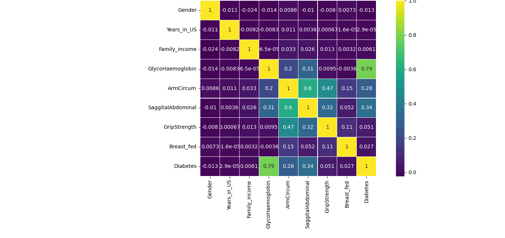
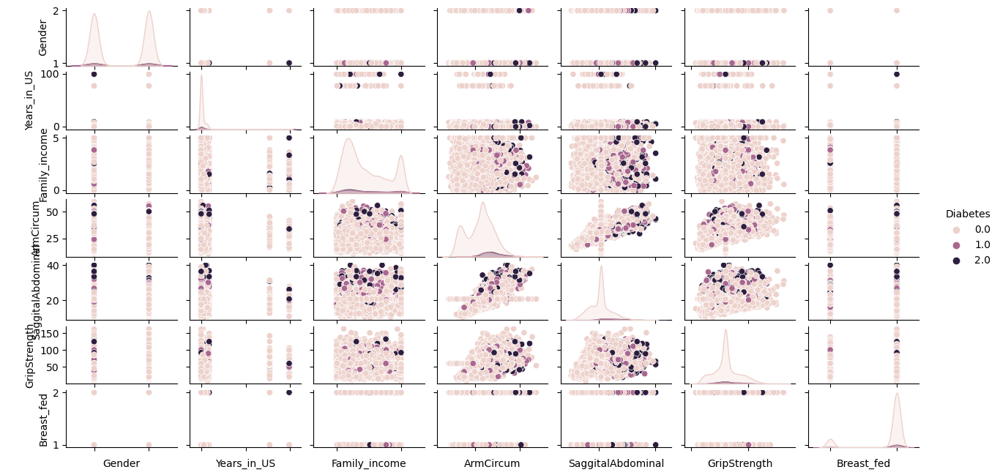

## Diabetes Prediction Model
This model helps in prediction of the diabetes. This model uses Bagging regression Model.

## Get Started
 ### The following is are the procedures to get you started.
    1) Fork the repository.
    2) git clone the repository to a local machine.
    3) Improve or revamp the code by any contribution.
    4) Pull request for a change to be applied.

## Contribution
Everyone willing to contribute. No limitation to contribution of this project.

## Literature Review
Logistic Regression is an algorithm that is used to predict certain scenarios, for example, spam or not spam, 0 or 1 and many more.

Logistic Regression is as well based on probability concept. We use sigmoid function to map the the predicted values to probabilities

When using Logistic regression we are always needed to call the logistic regression instance object to initialize the Logistic Regression function.

## Issues
Feel free to push an issue and will be happy to respond or solve.

## Results
For corellation, results the following

    

        
    

  

The model results the following with the scores below.

    

        
    

## Prediction Scores 
 ### Results Our model produces after run.
    Logistic Regression Mean Square Error: 0.24
    Logistic Regression Variance score: 0.06
    Logistic Regression Score: 0.06 
